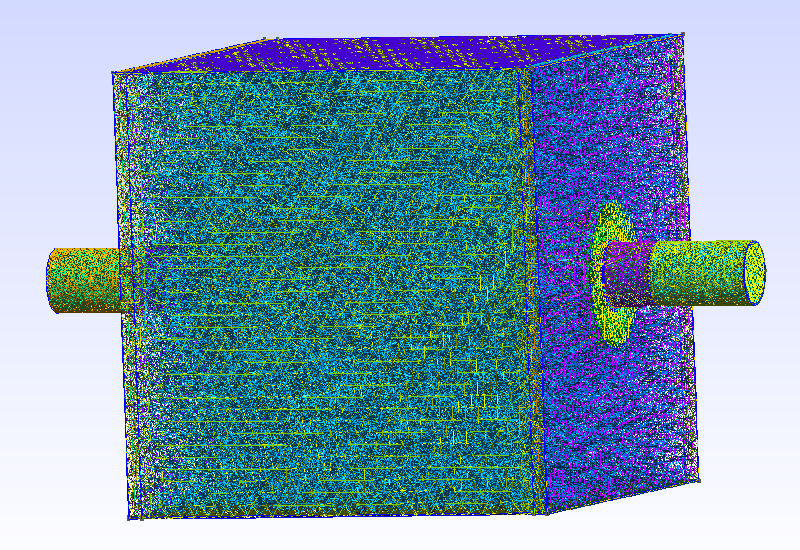
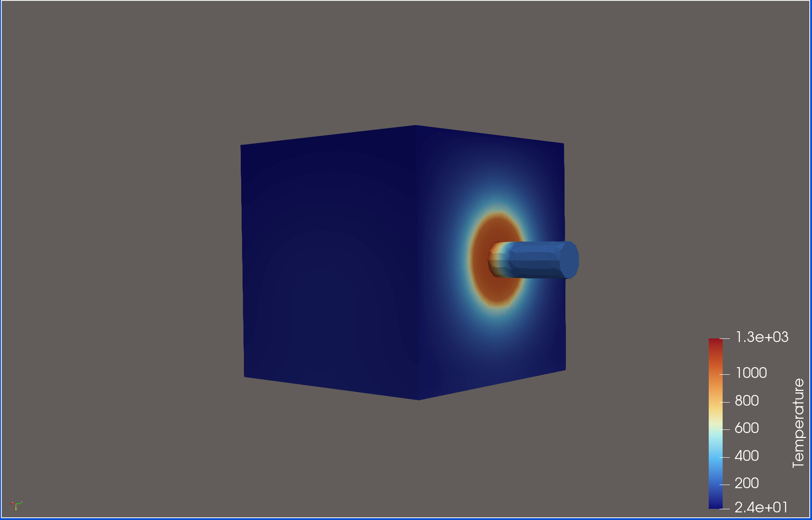
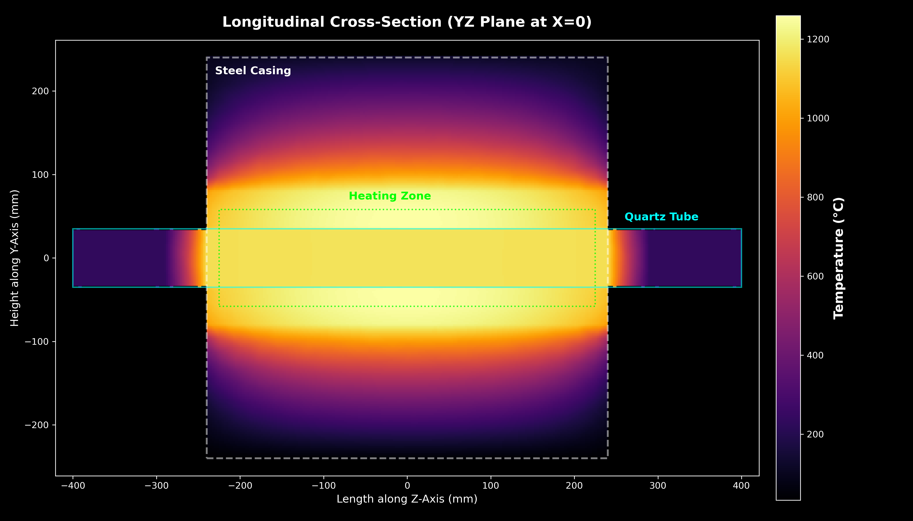
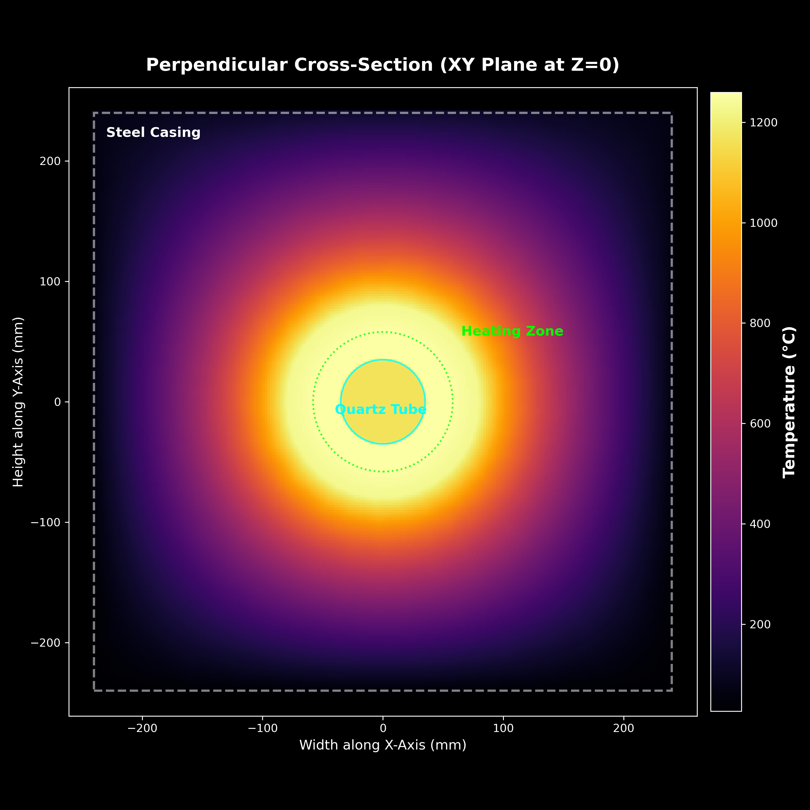

# Furnace Thermal Simulation

A Finite Element Analysis (FEA) based thermal simulation of an electric heating furnace. This project models the spatial buoyancy gradients, heat conduction, and convective heat transfer of a tubular furnace apparatus. Built on FEniCSx and Gmsh.

## Project Overview

This repository is dedicated to a modular, Finite Element Analysis (FEA) based thermal simulation of an electric heating tubular furnace. The project mathematically models:
- **Spatial Buoyancy Gradients**: Accurate convective heat transfer considering atmospheric environments bounding the steel casing.
- **Solid Heat Conduction**: Heat dissipation modeling through layered physical materials like alumina cement, ceramic fiber boards, and the central quartz heating tube.
- **Volumetric Heat Generation**: Simulation of a central 1500W heating element applying steady-state thermal loads.

Using advanced parametric modeling via **Gmsh**, the codebase constructs the comprehensive 3D tetrahedral geometry of the furnace. It then bridges this geometry into pristine XDMF matrices to act as the primary domain for **FEniCSx**, a highly-parallelized matrix solver, which solves the partial differential equations across the mesh. It achieves this while retaining a clean, automated Python pipeline for execution and visualization.

## Prerequisites

To run this project, we rely on advanced FEA scientific computing libraries which are best installed via `conda-forge`. FEniCSx and Gmsh have complex C++ bindings that Conda handles automatically.

### System Setup
If you don't already have Conda installed, you can quickly install `Miniforge` (a lightweight Conda installer prioritizing `conda-forge`) entirely from your terminal:

```bash
curl -L -O "https://github.com/conda-forge/miniforge/releases/latest/download/Miniforge3-$(uname)-$(uname -m).sh"
bash Miniforge3-$(uname)-$(uname -m).sh -b -p $HOME/miniforge3

source $HOME/miniforge3/etc/profile.d/conda.sh
conda init
```
*(Note: You may need to restart your terminal or open a new window afterward for the `conda` command to be fully active.)*

## Installation Instructions

1. **Clone/Download the Repository**
```bash
git clone [https://github.com/rushatdixit/tube-furnace-simulator.git](https://github.com/rushatdixit/tube-furnace-simulator.git)
cd tube-furnace-simulator
```

2. **Create a Conda Environment**
We will create an isolated Conda environment and install Python.
```bash
conda create -n furnace_env -c conda-forge python=3.11
conda activate furnace_env
```

3. **Install Dependencies**
Using the provided `requirements.txt`, install all required mathematical and FEA packages simultaneously. By using `conda-forge`, it ensures `dolfinx`, `mpi4py`, and `gmsh` link properly.
```bash
conda install -c conda-forge --file requirements.txt
```

*(Note: Depending on your exact architecture (e.g., Apple Silicon M-series vs Intel), Conda will automatically fetch the right compatible MPICH/OpenMPI libraries.)*

---

## Running the Simulation Pipeline

The entire system is orchestrated by a single script that runs from the **root directory** (`/furnace`). It sequentially generates the mesh, converts the geometry into FEA data, and executes the thermal solver.

```bash
python simulate.py
```

## Outputs

The simulation script will automatically construct any missing subdirectories inside the `data` folder. You can expect:
- **`data/visuals/`**: High-quality 2D annotated heatmaps of both longitudinal and perpendicular cross-sections.
- **`data/xdmf-s/`**: The complete 3D simulation results capable of being opened natively in applications like **ParaView**.
- **`data/meshes/`**: The compiled Gmsh tetrahedron files.

## Simulation Outputs

### 1. 3D Mesh Generation (Gmsh)
*The tetrahedral mesh topology showing the quartz tube, heating element zone, and multi-layer insulation plugs.*


### 2. 3D Volumetric Thermal Field (ParaView)
*The raw XDMF/HDF5 solution exported from FEniCSx, visualized using an interactive clipping plane in ParaView.*


### 3. Longitudinal Cross-Section (Matplotlib)
*A high-resolution 2D slice along the Z-axis (YZ Plane) showing heat radiating out of the exposed quartz tips.*


### 4. Perpendicular Cross-Section (Matplotlib)
*A slice looking straight down the barrel (XY Plane), demonstrating the asymmetric "hot top" buoyancy gradient pooling against the upper steel casing.*


---

## Exploring with ParaView

Because this project solves complex 3D thermodynamics, the primary raw outputs are `.xdmf` matrices. To view these interactively:

### 1. Install ParaView
You can easily install ParaView directly from the terminal (if you are on macOS with Homebrew):
```bash
brew install --cask paraview
```
*(On Linux/Windows, or without Homebrew, download it directly from [paraview.org](https://www.paraview.org/download/)).*

### 2. Loading the Model
1. Open the **ParaView** application.
2. Go to **File > Open** and locate your `data/xdmf-s/furnace_temperature.xdmf` file.
3. In the left-hand **Properties** panel, click the green **Apply** button to render the physical domain block.

### 3. Rendering Features
- **Color by Temperature**: In the top toolbar, find the dropdown menu that typically defaults to `Solid Color` and switch it to **`Temperature`**. The heat gradient will reflect our FEA solutions immediately.
- **Cross-section Slicing**: To look inside at the quartz tube and heating zone, click the **Slice** tool (icon of a plane cutting a cube) in the top menu. In its properties panel, choose the normal axis you wish to slice across (e.g. `X Normal`), uncheck the 'Show Plane' visualizer, and hit **Apply**.
